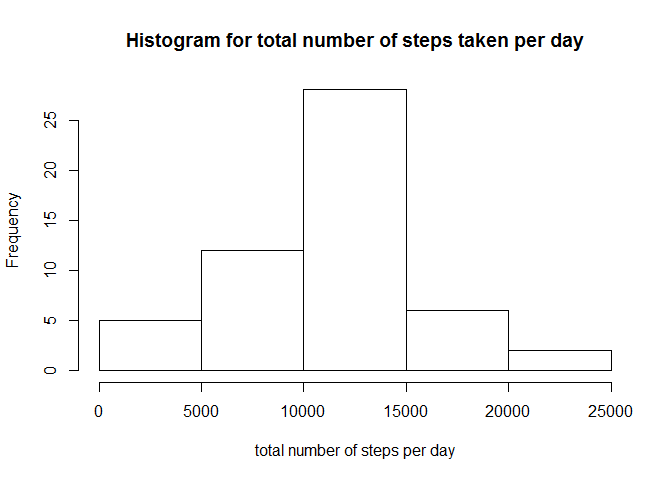
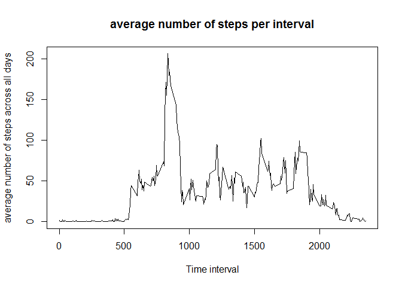
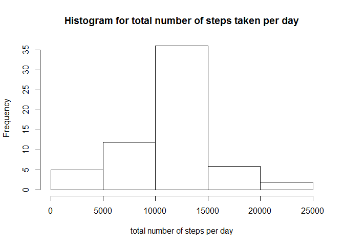
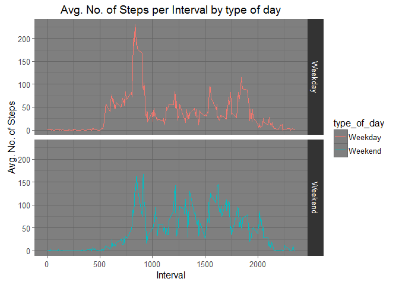

# Reproducible Research: Peer Assessment 1 - Sairam Praneeth


## Loading and preprocessing the data

### Load ggplot2


```r
library(ggplot2)
```

### 1. Loading the data.


```r
download.file("https://d396qusza40orc.cloudfront.net/repdata%2Fdata%2Factivity.zip",destfile = "activity.zip")
unzip("activity.zip")
rawdata <- read.csv("activity.csv")
```

### 2. Preprocessing the data.


```r
# Transform date in "month day-number" format
newdate <- factor(format(as.Date(rawdata$date),"%b %d"))
rawdata$newdate <- newdate
# to omit NA from the data.
cleandata <- na.omit(rawdata)
```

## What is mean total number of steps taken per day?

### Plotting the Histogram


```r
# Total number of steps taken per day.
total_steps_taken_per_day <- aggregate(cleandata$steps,list(cleandata$newdate),sum)

hist(total_steps_taken_per_day$x,main = "Histogram for total number of steps taken per day",xlab = "total number of steps per day")
```

<!-- -->

### Mean of Total steps taken per day


```r
round(mean(total_steps_taken_per_day$x))
```

```
## [1] 10766
```

### Median of Total steps taken per day


```r
median(total_steps_taken_per_day$x)
```

```
## [1] 10765
```

## What is the average daily activity pattern?

1. Make a time series plot (i.e. type = "l") of the 5-minute interval (x-axis) and the average number of steps taken, averaged across all days (y-axis)

### Time Series Plot


```r
# Mean of steps across all days per interval
mean_steps_per_interval <- aggregate(steps ~ interval,cleandata,mean)

plot(mean_steps_per_interval$interval,mean_steps_per_interval$steps,type = "l",main = "average number of steps per interval",xlab = "Time interval",ylab = "average number of steps across all days")
```

<!-- -->

### Interval with highest average number of steps


```r
index <- which.max(mean_steps_per_interval$steps)

print(paste("Interval with the highest average number of steps =",mean_steps_per_interval[index,]$interval))
```

```
## [1] "Interval with the highest average number of steps = 835"
```

```r
print(paste("Number of steps for the interval with the highest avg. number of steps =",mean_steps_per_interval[index,]$steps))
```

```
## [1] "Number of steps for the interval with the highest avg. number of steps = 206.169811320755"
```

## Imputing missing values

1. Calculate and report the total number of missing values in the dataset (i.e. the total number of rows with NAs).
2. Devise a strategy for filling in all of the missing values in the dataset. The strategy does not need to be sophisticated. For example, you could use the mean/median for that day, or the mean for that 5-minute interval, etc.
3. Create a new dataset that is equal to the original dataset but with the missing data filled in.
4. Make a histogram of the total number of steps taken each day and Calculate and report the mean and median total number of steps taken per day. Do these values differ from the estimates from the first part of the assignment? What is the impact of imputing missing data on the estimates of the total daily number of steps?

### The number of rows having missing values for steps


```r
# Number of rows with missing values
missing_rows <- rawdata[!complete.cases(rawdata),]
nrow(missing_rows)
```

```
## [1] 2304
```

### Completing the data for NA values

We can use the following method to fill NA values: avg steps for the interval of the NA row.

we will create a complete dataset by the avg. number of steps per interval and compare it's mean and median to the dataset with the NA rows omitted.


```r
completedata <- rawdata

for(i in 1:nrow(rawdata)){
  if(is.na(rawdata[i,]$steps)){
    completedata[i,]$steps <- mean_steps_per_interval[which(mean_steps_per_interval$interval == rawdata[i,]$interval),]$steps
  }
}
```

### Histogram of total number of steps per day of the Completed Data


```r
# Total number of steps taken per day.
new_total_steps_taken_per_day <- aggregate(completedata$steps,list(completedata$newdate),sum)

hist(new_total_steps_taken_per_day$x,main = "Histogram for total number of steps taken per day",xlab = "total number of steps per day")
```

<!-- -->

### Mean of Total steps taken per day for completed data


```r
round(mean(new_total_steps_taken_per_day$x))
```

```
## [1] 10766
```

### Median of Total steps taken per day for completed data


```r
median(new_total_steps_taken_per_day$x)
```

```
## [1] 10766.19
```

The values of the Mean and the Median for the Complete Dataset are similar when Compared to that of the Dataset with the NA rows omitted.

## Are there differences in activity patterns between weekdays and weekends?

1. Create a new factor variable in the dataset with two levels - "weekday" and "weekend" indicating whether a given date is a weekday or weekend day.
2. Make a panel plot containing a time series plot (i.e. type = "l") of the 5-minute interval (x-axis) and the average number of steps taken, averaged across all weekday days or weekend days (y-axis). See the README file in the GitHub repository to see an example of what this plot should look like using simulated data.

### Creating a new factor variable to determine weekday or weekend


```r
# Create a function to deteremine weekday or weekend day
weekday_or_weekend <- function(x){
  day <- weekdays(as.Date(x))
  if(day == "Saturday" || day == "Sunday")  d <- "Weekend"
  else d <- "Weekday"
  d
}

# The new factor variable is type_of_day
completedata$type_of_day <- as.factor(sapply(completedata$date, weekday_or_weekend))
```

### Panel plot between Weekday and Weekend Day


```r
# Aggregate steps by the interval and type of day
mean_steps <- aggregate(steps ~ interval + type_of_day,completedata,mean)

# Create the panel plot
pplot <- ggplot(data = mean_steps,mapping = aes(interval,steps))
pplot <- pplot + geom_line(aes(colour = type_of_day))
pplot <- pplot + theme_dark()
pplot <- pplot + facet_grid(type_of_day ~ .)
pplot <- pplot + labs(x = "Interval",y = "Avg. No. of Steps")
pplot <- pplot + ggtitle("Avg. No. of Steps per Interval by type of day")

print(pplot)
```

<!-- -->

As we can see there is a spike in the number of steps taken during the early intervals of weekdays as compared to weekends. We can conclude that the person is more active during the morning intervals of weekdays as when compared to that of weekends. Morever, the average number of steps taken is distributed over a period of intervals for weekends whereas for weekdays, the average number of steps taken is more concentrated at a particular interval and not distributed as evenly as that of weekends.
